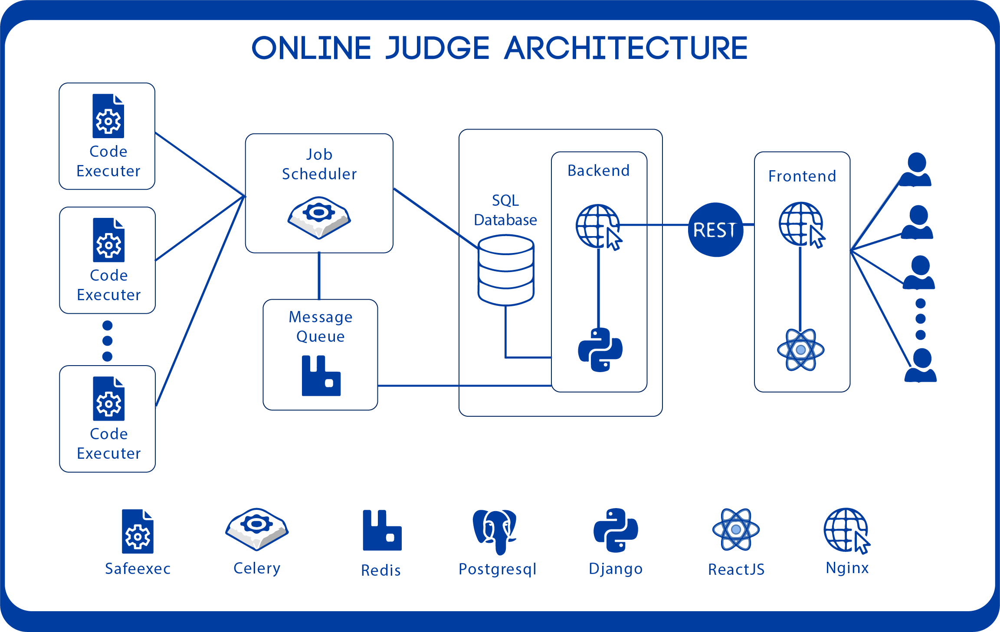

<p align="center">
  <a href="#">
    
  </a>
</p>


[](https://app.netlify.com/sites/zen-galileo-d63570/deploys)

# Online-Judge
Port of the Online Judge in Python

## Architecture
<p align="center">
    
</p>

## Working

Initially the user chooses a language in the code editor and starts to write the answer based on the coding question. When the user submits the answer, the answer passes to the server. In the server a task id is being created in the PostgreSQL and the job is being sent to the Redis queue. Then celery picks up the job and executes it in a sandbox environment which is developed using C. This helps to increase security and prevents malicious code injection attacks on the platform. When the job finnishes execution the result is sent to the frontend using long polling. In this way the system verifies the users code, evaluate it and generates it ranking based on scores from other peers.

## Documentation to help with Celery
https://docs.celeryproject.org/en/stable/getting-started/next-steps.html#next-steps

## API Documentation

https://documenter.getpostman.com/view/7834053/Szmh1vuz?version=latest

## Safeexec Submodule

The sandbox environment has been submoduled to the original repo so the changes immediately reflect back here.
To work with submodules:

```
1. git submodule init
2. git submodule update
3. cd safeexec
4. cmake .
5. make

```
From next time onwards, we need to check if the submodules have been updated, to do that:

```
git pull --recurse-submodules

```

## Development Environment Config
This project uses PEP8 code style, please make sure to follow. Yapf is our preffered formatting tool.
If you are using VSCode add the following in your *settings.json* 
```
"python.formatting.provider": "yapf",
"python.formatting.yapfArgs": ["--style={based_on_style: pep8, indent_width: 4, column_limit: 120}"],
"python.linting.enabled": true
```

For the code execution part to function properly, you need to install redis. Steps to install redis are as follows:

1. `sudo apt install redis-server`
2. `sudo nano /etc/redis/redis.conf`
3. Inside the file find the `supervised` directive and change it to `systemd`. It should be set to `no` by default.
  ```
    ...
    supervised systemd
    ...
  ```
4. `sudo systemctl restart redis.service`
5. Add `redis://localhost:6379` in the `CELERY_BROKER_URL` part of the `.env` file you have in your locally cloned repository.

To check if redis is working or not:

1. Type in `redis-cli`
2. Type `ping`
3. If it returns `PONG`, then your redis-broker server is running fine.

